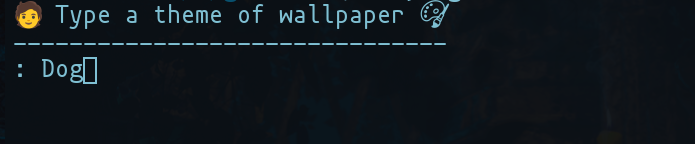
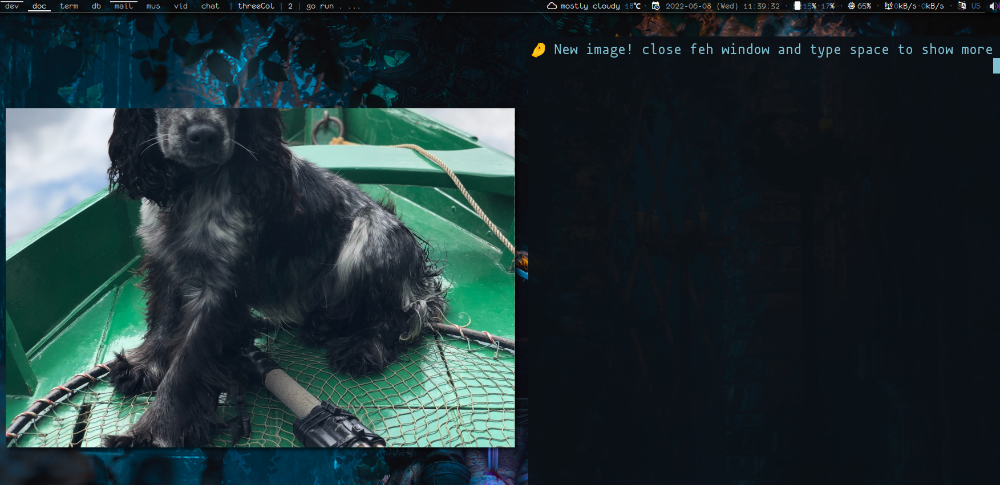
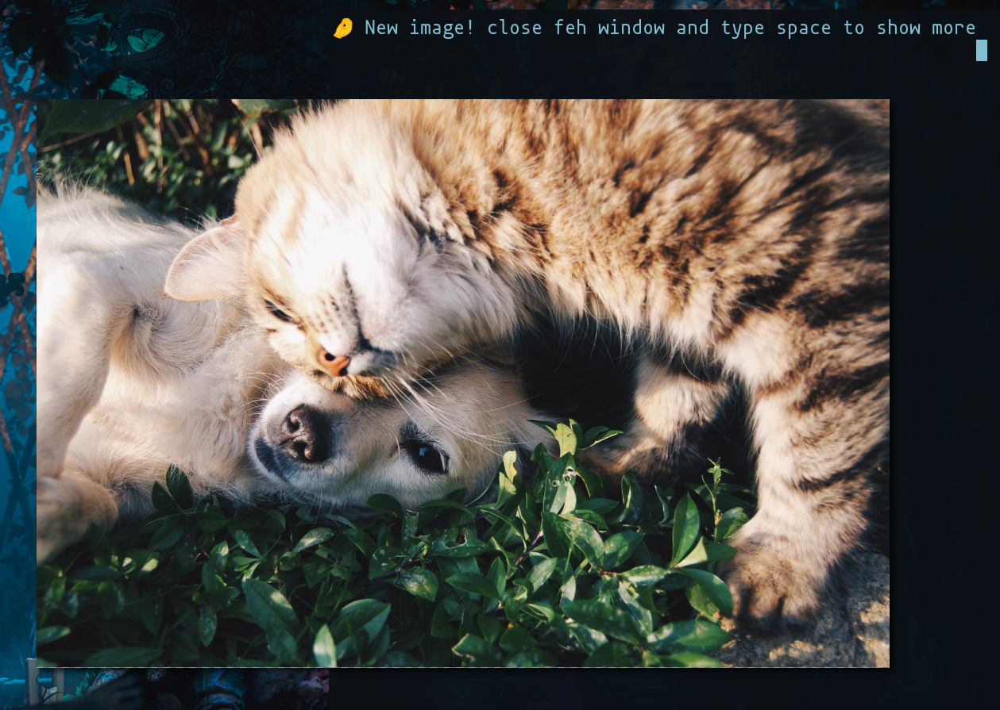

# crispy-pancake 

## Requirements 
- pxl 
- term 
- feh 
- xgb 
- xgbutil 
- runewidth 
- freetype-go 
- graphics-go 
- ueberzug-go 
- termbox-go 

## How to Run 
- git clone https://github.com/marssaljr/crispy-pancake.git 
- cd crispy-pancake
- go get .
- go run .
  
## Images

